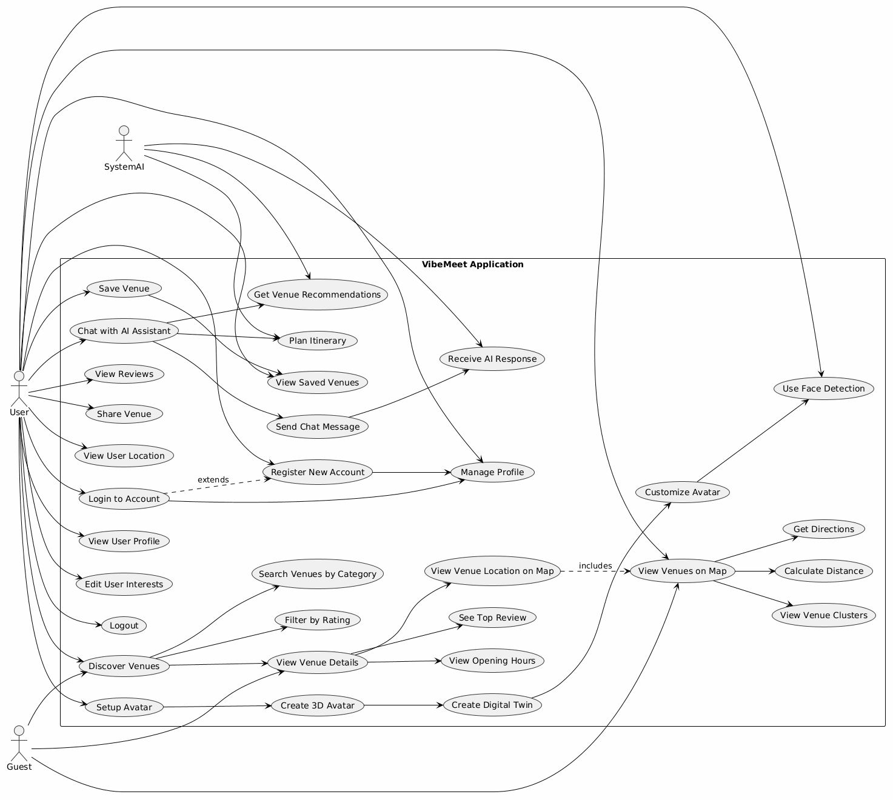
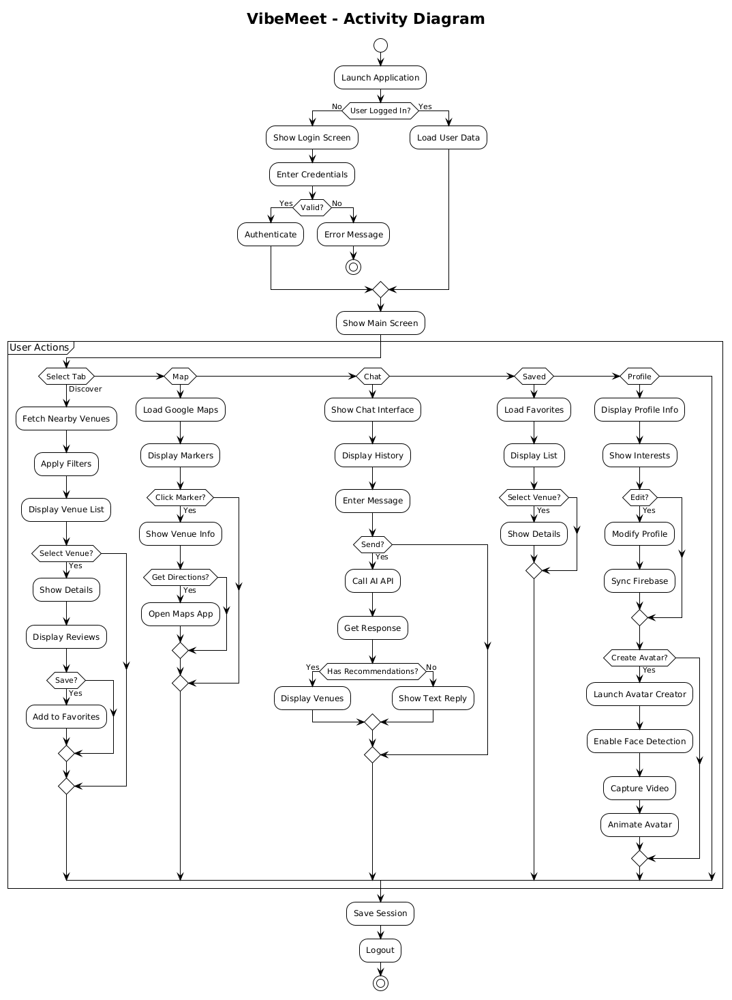
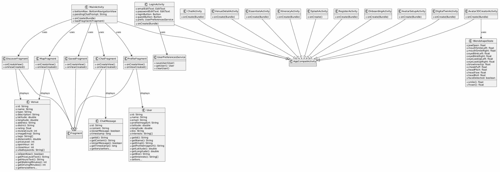

<div align="center">

# 📍 VibeMeet

### Application mobile Android intelligente de découverte et de recommandation de lieux

*Smart city discovery for Casablanca*


</div>

---

## 🧭 À propos

**VibeMeet** est une application mobile Android qui aide les utilisateurs à découvrir les meilleurs lieux de **Casablanca** — restaurants, cafés, lieux culturels et de loisirs — de manière personnalisée et contextuelle.

L'application combine plusieurs technologies avancées dans une seule expérience fluide : un **assistant IA conversationnel** qui connaît la ville, une **carte interactive géolocalisée**, la **commande vocale**, et un **avatar 3D** animé en temps réel par la détection faciale. Le tout repose sur un backend **Supabase / PostgreSQL** exécuté en local via **Docker**.

---

## ✨ Fonctionnalités principales

- 🤖 **Assistant IA** — recommandations et conversation via OpenAI GPT-4o-mini, avec une expertise locale de Casablanca
- 🗺️ **Découverte géolocalisée** — exploration des lieux à proximité sur une carte Google Maps interactive
- 🎙️ **Commande vocale** — reconnaissance vocale Android pour interroger l'assistant sans clavier
- 🙂 **Avatar 3D temps réel** — détection faciale (CameraX + ML Kit + MediaPipe) reproduite sur un avatar 3D
- ❤️ **Favoris & historique** — sauvegarde des lieux préférés et des visites
- 🧳 **Itinéraires** — génération de parcours personnalisés par l'IA

---

## 🛠️ Technologies utilisées

| Domaine | Technologies |
|---|---|
| **Frontend** | Android Studio · Java · AndroidX · Gradle · Glide |
| **IA & Vision** | OpenAI GPT-4o-mini · MediaPipe · ML Kit · CameraX |
| **Backend** | Supabase · PostgreSQL · Docker · Row Level Security · PostgREST |
| **Cartographie** | Google Maps SDK · Location Services · Places SDK |
| **Réseau & Données** | OkHttp · SharedPreferences |

---

## 🏗️ Architecture

L'application suit une **architecture en couches** :

```
┌─────────────────────────────────────────────────────────┐
│  Présentation     →  Activities, Fragments, Vues          │
├─────────────────────────────────────────────────────────┤
│  Métier           →  Services (Venue, Location, OpenAI…)  │
├─────────────────────────────────────────────────────────┤
│  Accès aux données →  SharedPreferences · OkHttp / REST   │
├─────────────────────────────────────────────────────────┤
│  Externe          →  Supabase · OpenAI · Google · Avatar  │
└─────────────────────────────────────────────────────────┘
```

---

## 📊 Diagrammes UML

### Diagramme de cas d'utilisation
> Acteurs (User, Guest, SystemAI) et cas d'usage de l'application.



### Diagramme d'activité
> Flux principal : lancement, authentification et actions utilisateur (Discover, Map, Chat, Saved, Profile).



### Diagramme de classes
> Activities, Fragments, Services et modèles (Venue, User, ChatMessage, BlendshapeState).



---

## 🚀 Démarrage rapide

### Backend (Supabase local via Docker)

```bash
# Installer Docker Desktop et la CLI Supabase, puis :
supabase start        # lance PostgreSQL, l'API REST et Supabase Studio (Docker)
supabase db reset     # applique le schéma et les données de seed
```

- API REST : `http://localhost:54321`
- Console Studio : `http://localhost:54323`

### Application Android

1. Ouvrir le projet dans **Android Studio**
2. Renseigner les clés d'API (OpenAI, Google Maps/Places, Supabase) dans la configuration
3. Lancer l'application sur un émulateur ou un appareil (Android 7.0+ / API 24+)

---

## 🎬 Démonstration

Une **vidéo de démonstration** de l'application est disponible dans le dépôt : [`presentation_LhivEVeH.mp4`](presentation_LhivEVeH.mp4)

---

## 👤 Auteur

**Benzhirou Alaeddine**
Encadré par **Prof. Bousmah Mohammed**
École Marocaine des Sciences de l'Ingénieur (EMSI) — Campus des Orangers, Casablanca
Projet de Fin d'Études · 2025-2026

---

<div align="center">

*VibeMeet — Transforming location discovery through innovation.*

</div>
